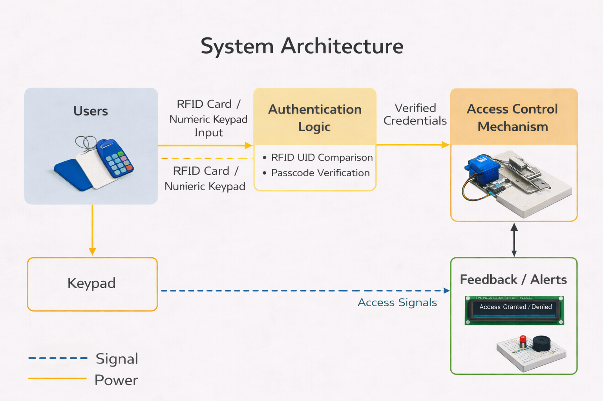
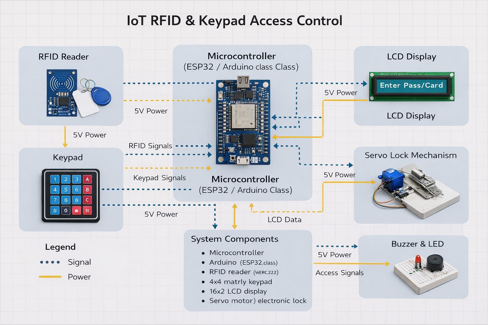
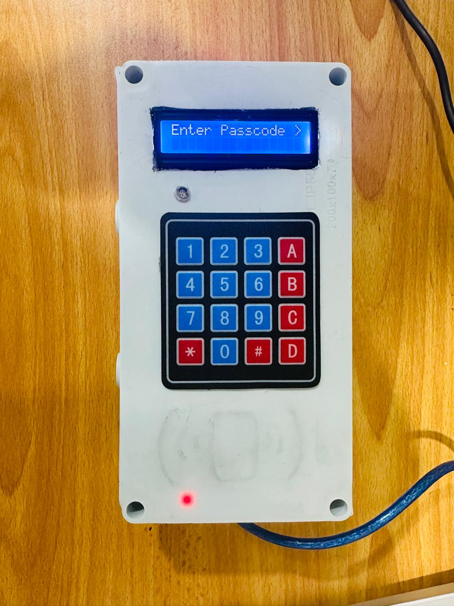
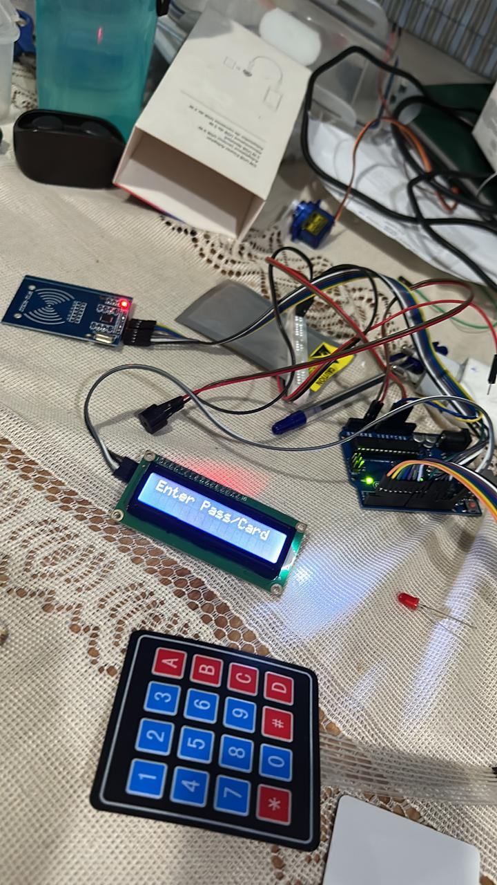
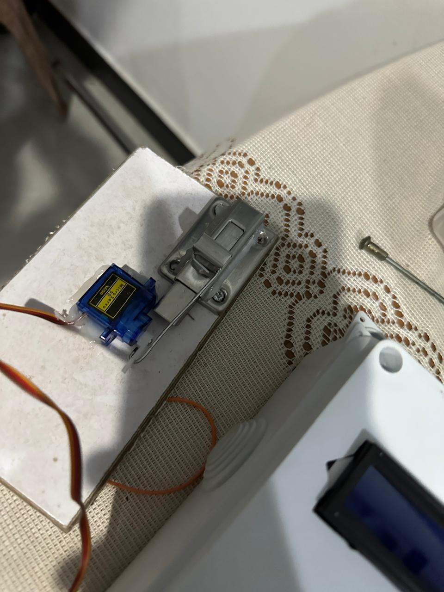

```md
# IoT RFID & Keypad Access Control System

An embedded IoT access control hardware prototype implementing RFID-based authentication with keypad passcode fallback, real-time LCD feedback, and an electromechanical locking mechanism.

This system was designed, built, and publicly demonstrated as a working prototype at the **LNBTI Talent Show & IoT Exhibition (2023)**.

---

## Overview

This project represents a secure physical access control system where users authenticate using an RFID card.  
If RFID authentication fails or is unavailable, a keypad-based passcode provides a controlled fallback.

System state and access decisions are displayed via an LCD, while a servo-driven locking mechanism physically controls access.

The repository focuses on **embedded system design, hardware–software integration, and documented implementation**, rather than production deployment.

---

## Key Features

- RFID UID-based authentication
- Keypad passcode fallback mechanism
- LCD-based system feedback (Idle / Granted / Denied)
- Servo-controlled physical locking
- Embedded control logic with defined system states
- Successfully demonstrated physical prototype

---

## System Workflow

1. System initializes and enters idle state  
2. User scans RFID card or enters keypad passcode  
3. Credentials are validated in firmware  
4. LCD displays authentication result  
5. Servo unlocks or remains locked  
6. System resets after a fixed timeout  

---

## System Architecture



**Architecture Summary**

- **Input Layer:** RFID reader, keypad  
- **Control Layer:** Microcontroller firmware (ESP32 / Arduino-class)  
- **Output Layer:** LCD display, servo motor  
- **Logic Layer:** Authentication rules and state machine  

---

## Hardware Components

- Microcontroller (ESP32 / Arduino-class)
- MFRC522 RFID Reader
- 4×4 Matrix Keypad
- 16×2 LCD Display
- Servo motor / locking latch
- Power supply and discrete components

---

## Prototype Documentation

### System Overview


### Keypad and LCD Interface


### RFID Module


### Locking Mechanism


---

## Public Demonstration

This prototype was demonstrated live at:

**LNBTI Talent Show & IoT Exhibition — 2023**

  


The system was evaluated by academic staff and external visitors as a fully functional physical IoT prototype.

---

## Firmware Notes

The embedded firmware implemented the following functionality:

- RFID UID validation
- Keypad input parsing
- LCD state updates
- Timed lock and unlock control
- Failure handling and retry logic

**Note:**  
The original exhibition firmware is not preserved in this repository.  
This project emphasizes system behavior, hardware integration, and documented design.  
A clean firmware reimplementation may be added in the future.

---

## Repository Structure

```

iot-rfid-keypad-access-control/
│
├── docs/
│   ├── diagrams/
│   │   └── system-architecture.png
│   ├── photos/
│   └── exhibition/
│
├── README.md
└── ORIGINAL_PROJECT.md

```

---

## Project Status

- Hardware prototype completed
- Successfully demonstrated in a public exhibition
- Firmware reimplementation planned
- Cloud logging and connectivity extensions possible

---

## Skills Demonstrated

- Embedded systems design
- Hardware–software integration
- RFID-based authentication logic
- Physical access control workflows
- Microcontroller interfacing
- Technical documentation
- Public technical presentation

---

## Disclaimer

This project is an academic hardware prototype developed for demonstration and learning purposes.  
It is not intended for production or commercial security deployment.
```

---
